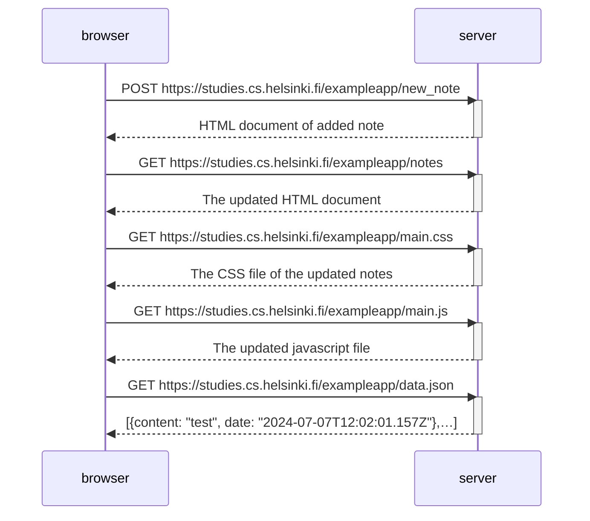

```mermaid
sequenceDiagram
  participant browser as browser
  participant server as server

  browser ->> server: POST https://studies.cs.helsinki.fi/exampleapp/new_note
  activate server
  server -->> browser: HTML document of added note
  deactivate server


  browser->>server:GET https://studies.cs.helsinki.fi/exampleapp/notes
  activate server
  server-->>browser:The updated HTML document
  deactivate server

  browser->>server:GET https://studies.cs.helsinki.fi/exampleapp/main.css
  activate server
  server-->>browser: The CSS file of the updated notes
  deactivate server

  browser->>server:GET https://studies.cs.helsinki.fi/exampleapp/main.js
  activate server
  server-->>browser: The updated javascript file
  deactivate server

  browser->>server:GET https://studies.cs.helsinki.fi/exampleapp/data.json
  activate server
  server-->>browser: [{content: "test", date: "2024-07-07T12:02:01.157Z"},…]
  deactivate server

```
