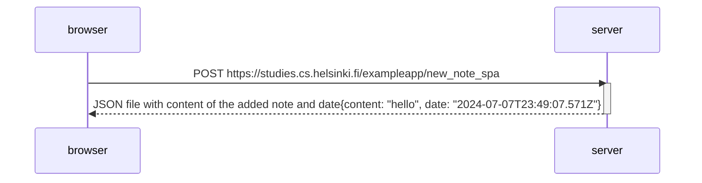

```mermaid
sequenceDiagram
  participant browser as browser
  participant server as server
  browser->>server:POST https://studies.cs.helsinki.fi/exampleapp/new_note_spa
  activate server
  server-->>browser:JSON file with content of the added note and date{content: "hello", date: "2024-07-07T23:49:07.571Z"}
  deactivate server
 
```
